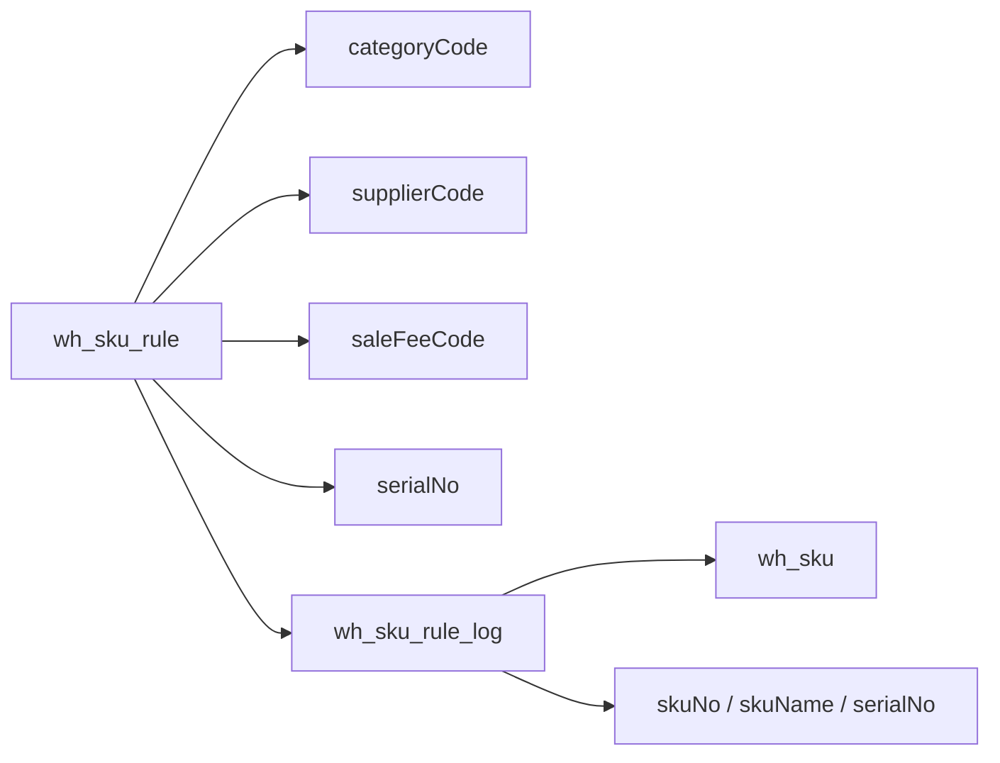

# SKU 编码规则实体链路

```mermaid
flowchart LR
    A["wh_sku_rule"] --> B["categoryCode"]
    A --> C["supplierCode"]
    A --> D["saleFeeCode"]
    A --> E["serialNo"]
    A --> F["wh_sku_rule_log"]
    F --> G["wh_sku"]
    F --> H["skuNo / skuName / serialNo"]
```
