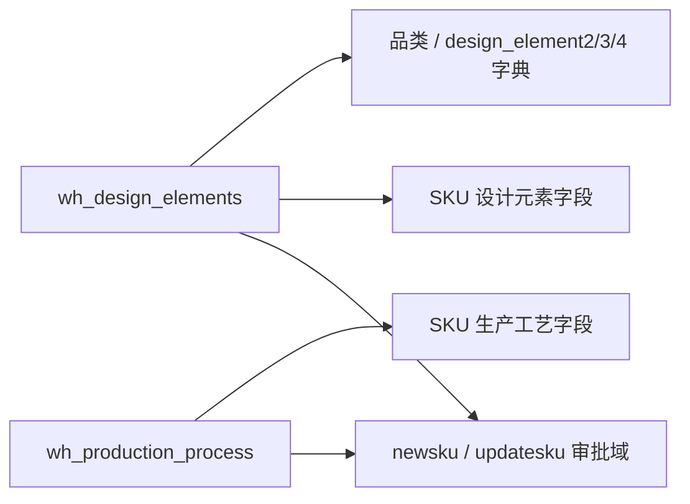

# SKU 规则主数据实体链路

```mermaid
flowchart LR
    A["wh_design_elements"] --> C["newsku / updatesku 审批域"]
    B["wh_production_process"] --> C
    A --> D["SKU 设计元素字段"]
    B --> E["SKU 生产工艺字段"]
    A --> F["品类 / design_element2/3/4 字典"]
```
