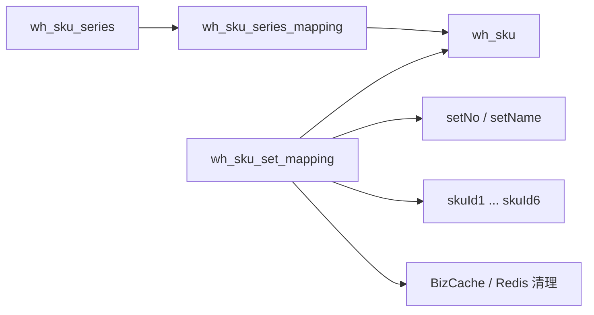

# 系列与套系映射实体链路

```mermaid
flowchart LR
    A["wh_sku_series"] --> B["wh_sku_series_mapping"]
    B --> C["wh_sku"]
    D["wh_sku_set_mapping"] --> C
    D --> E["setNo / setName"]
    D --> F["skuId1 ... skuId6"]
    D --> G["BizCache / Redis 清理"]
```
