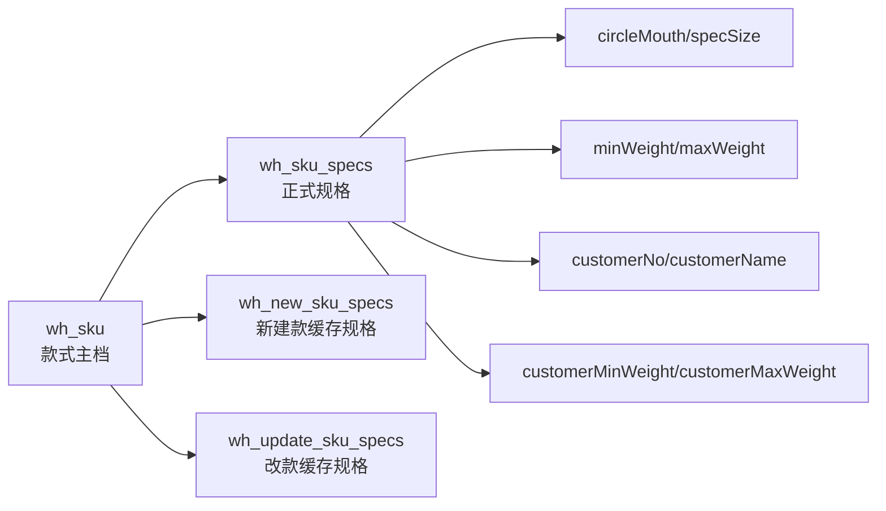

# SKU 规格实体链路

```mermaid
flowchart LR
    A["wh_sku<br/>款式主档"] --> B["wh_sku_specs<br/>正式规格"]
    A --> C["wh_new_sku_specs<br/>新建款缓存规格"]
    A --> D["wh_update_sku_specs<br/>改款缓存规格"]
    B --> E["circleMouth/specSize"]
    B --> F["minWeight/maxWeight"]
    B --> G["customerNo/customerName"]
    B --> H["customerMinWeight/customerMaxWeight"]
```
