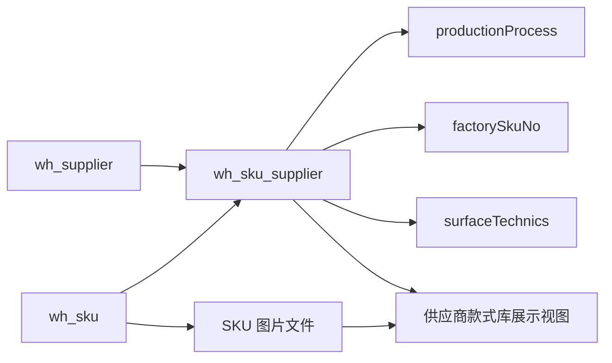

# SKU 供应商库实体链路

```mermaid
flowchart LR
    A["wh_sku"] --> C["wh_sku_supplier"]
    B["wh_supplier"] --> C
    C --> D["productionProcess"]
    C --> E["factorySkuNo"]
    C --> F["surfaceTechnics"]
    A --> G["SKU 图片文件"]
    G --> H["供应商款式库展示视图"]
    C --> H
```
