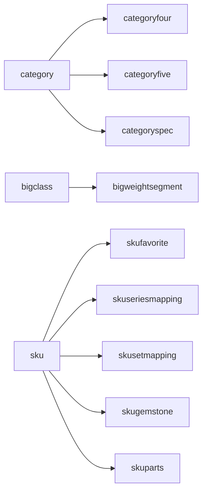

# 商品与 SKU 尾项实体链路图

```mermaid
flowchart LR
    A["category"] --> B["categoryfour"]
    A --> C["categoryfive"]
    A --> D["categoryspec"]
    E["bigclass"] --> F["bigweightsegment"]
    G["sku"] --> H["skufavorite"]
    G --> I["skuseriesmapping"]
    G --> J["skusetmapping"]
    G --> K["skugemstone"]
    G --> L["skuparts"]
```
