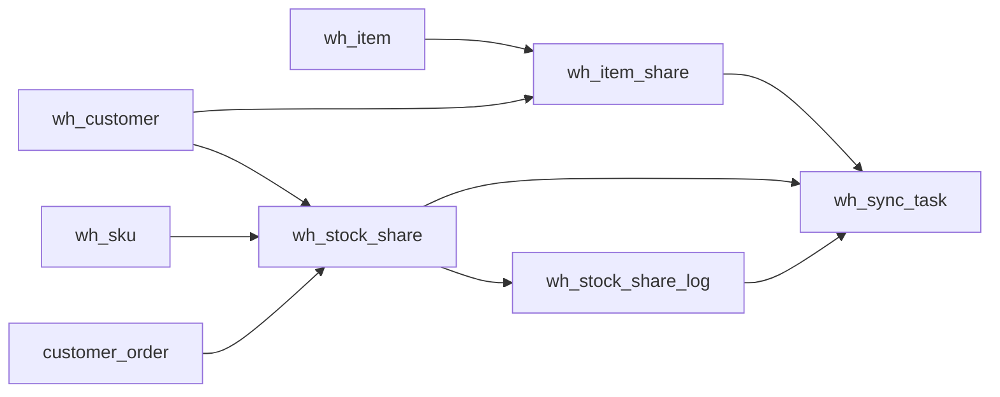

# 旧版共享库存域实体链

```mermaid
flowchart LR
    ITEM["wh_item"] --> ITEM_SHARE["wh_item_share"]
    CUSTOMER["wh_customer"] --> ITEM_SHARE
    CUSTOMER --> STOCK_SHARE["wh_stock_share"]
    SKU["wh_sku"] --> STOCK_SHARE
    STOCK_SHARE --> STOCK_LOG["wh_stock_share_log"]
    ITEM_SHARE --> SYNC["wh_sync_task"]
    STOCK_SHARE --> SYNC
    STOCK_LOG --> SYNC
    ORDER["customer_order"] --> STOCK_SHARE
```
