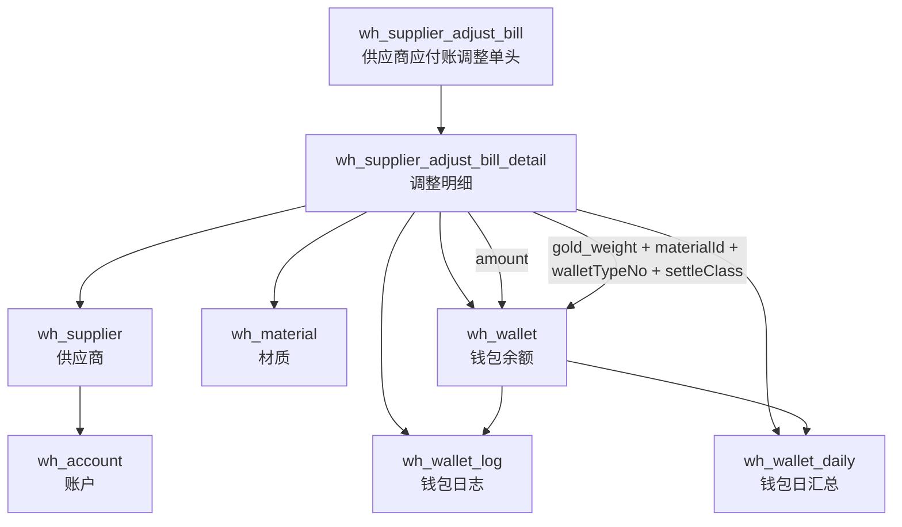

# 供应商应付账调整实体关系图
> 核心关注：供应商应付账调整如何把金额账、金重账分别落到钱包链

## 关系说明
- 单头只负责承载日期、状态、审核人、备注等头信息。
- 真正驱动钱包动账的是明细表，不是单头汇总金额。
- 一条明细可拆成两笔钱包动作：
  - `amount`：固定走现金钱包。
  - `gold_weight`：按材质/钱包类型/结算类别定位材质钱包。
- 钱包余额、日志、日汇总由 `createWalletByAccountNew()` 在同一次服务调用里统一维护。
