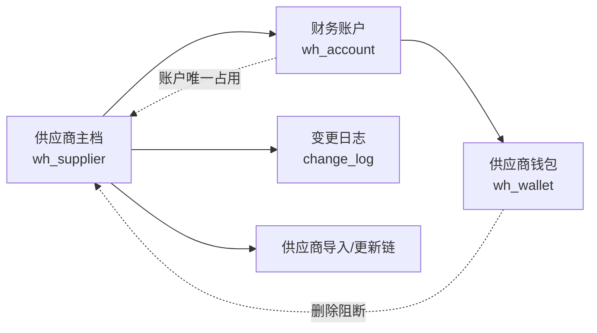

# 供应商档案实体链路图

```mermaid
flowchart LR
    A["供应商主档<br/>wh_supplier"] --> B["财务账户<br/>wh_account"]
    B --> C["供应商钱包<br/>wh_wallet"]
    A --> D["变更日志<br/>change_log"]
    A --> E["供应商导入/更新链"]

    C -.删除阻断.-> A
    B -.账户唯一占用.-> A
```
