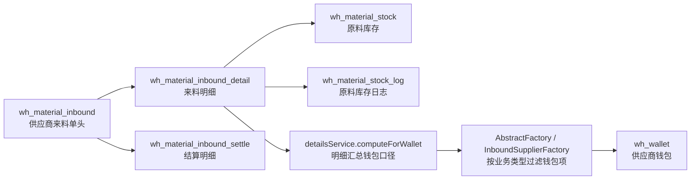

# 供应商来料单实体图

```mermaid
flowchart LR
    A["wh_material_inbound\n供应商来料单头"] --> B["wh_material_inbound_detail\n来料明细"]
    A --> C["wh_material_inbound_settle\n结算明细"]
    B --> D["wh_material_stock\n原料库存"]
    B --> E["wh_material_stock_log\n原料库存日志"]
    B --> F["detailsService.computeForWallet\n明细汇总钱包口径"]
    F --> G["AbstractFactory / InboundSupplierFactory\n按业务类型过滤钱包项"]
    G --> H["wh_wallet\n供应商钱包"]
```

## 说明
1. 供应商来料的钱包主账主要吃明细汇总，不是客户来料那种结算明细主导
2. `2201` 采购入库会在现金钱包和材质钱包之间做过滤
3. `2202` 提纯入库则可能两边都动
