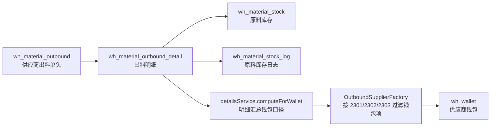

# 供应商出料单实体图

```mermaid
flowchart LR
    A["wh_material_outbound\n供应商出料单头"] --> B["wh_material_outbound_detail\n出料明细"]
    B --> C["wh_material_stock\n原料库存"]
    B --> D["wh_material_stock_log\n原料库存日志"]
    B --> E["detailsService.computeForWallet\n明细汇总钱包口径"]
    E --> F["OutboundSupplierFactory\n按 2301/2302/2303 过滤钱包项"]
    F --> G["wh_wallet\n供应商钱包"]
```

## 说明
1. `2301` 只动材质钱包
2. `2302` 同时动材质和现金
3. `2303` 只动现金钱包
