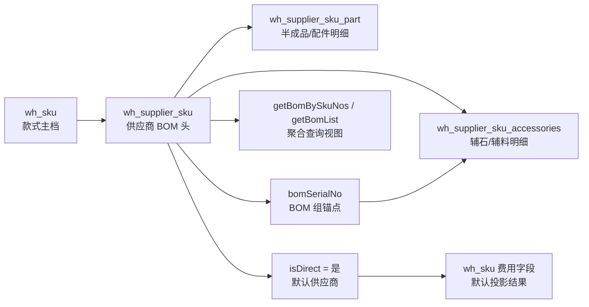

# 供应商款式 / BOM 实体链路

```mermaid
flowchart LR
    A["wh_sku<br/>款式主档"] --> B["wh_supplier_sku<br/>供应商 BOM 头"]
    B --> C["wh_supplier_sku_accessories<br/>辅石/辅料明细"]
    B --> D["wh_supplier_sku_part<br/>半成品/配件明细"]
    B --> E["isDirect = 是<br/>默认供应商"]
    E --> F["wh_sku 费用字段<br/>默认投影结果"]
    B --> G["getBomBySkuNos / getBomList<br/>聚合查询视图"]
    B --> H["bomSerialNo<br/>BOM 组锚点"]
    H --> C
```
