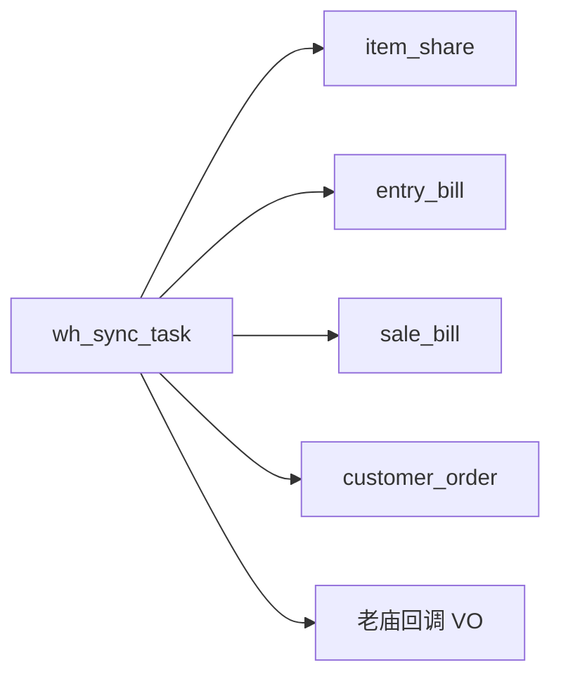

# 接口同步任务实体链

```mermaid
flowchart LR
    TASK["wh_sync_task"] --> ITEMSHARE["item_share"]
    TASK --> ENTRY["entry_bill"]
    TASK --> SALE["sale_bill"]
    TASK --> ORDER["customer_order"]
    TASK --> LM["老庙回调 VO"]
```
