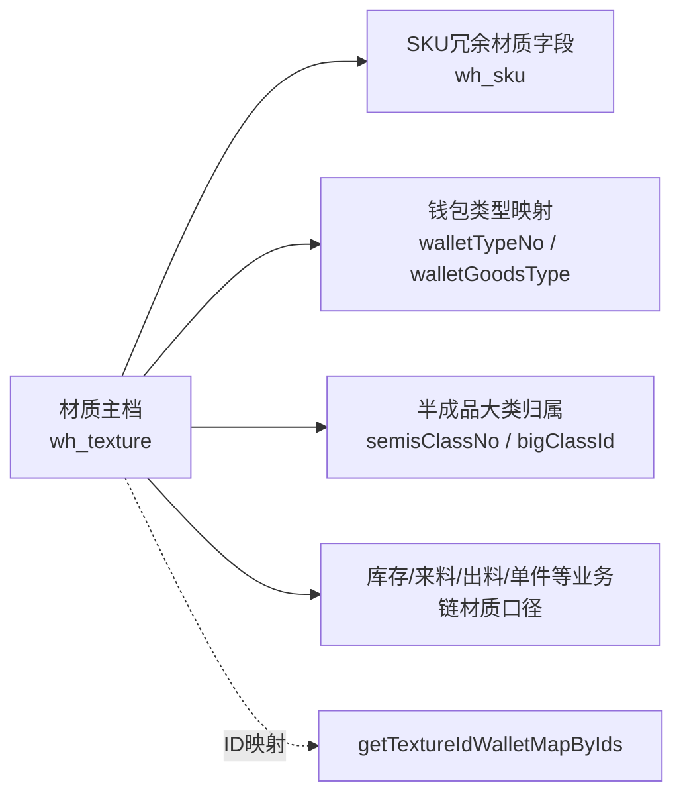

# 材质档案实体链路图

```mermaid
flowchart LR
    A["材质主档<br/>wh_texture"] --> B["SKU冗余材质字段<br/>wh_sku"]
    A --> C["钱包类型映射<br/>walletTypeNo / walletGoodsType"]
    A --> D["半成品大类归属<br/>semisClassNo / bigClassId"]
    A --> E["库存/来料/出料/单件等业务链材质口径"]

    A -.ID映射.-> F["getTextureIdWalletMapByIds"]
```
