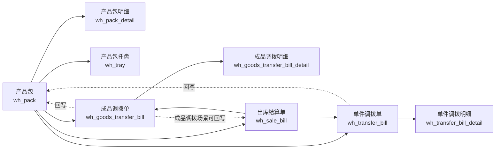

# 调拨主链实体图
> 基于 commit: `48af575a1314636c88e9f05ca3cb4443f88865bd`，日期：2026-03-31

## 适用范围
- 产品包发起单件调拨
- 产品包发起成品调拨
- 结算单关联产品包的调拨接收/拒签/退回
- 调拨审核、接收、驳回、退回后对产品包/结算单的回写

## Mermaid

## 关键回写字段
| 来源模块 | 目标表 | 字段 | 触发动作 |
|------|------|------|------|
| 调拨单 | `wh_pack` | `transferBillId` | 审核通过 |
| 调拨单 | `wh_pack` | `transferBillNo` | 审核通过 |
| 调拨单 | `wh_pack` | `transferType` | 审核通过 |
| 调拨单 | `wh_pack` | `transferStatus` | 审核、接收、拒签、退回、反审 |
| 成品调拨单 | `wh_pack` | `transferBillId / transferBillNo / transferType / transferStatus` | 审核、接收、拒签、退回、反审 |
| 成品调拨单 | `wh_sale_bill` | `transferBillId / transferBillNo / transferType / transferStatus` | 源单据是结算单时 |
| 调拨单 / 成品调拨单 | `wh_pack / wh_sale_bill` | `transferBillId / transferBillNo` | 作废时清空 |

## 关键状态桥接

### 产品包侧
1. `genConfirmTransfer()` 后：
   - `transferBillId = 调拨单ID`
   - `transferBillNo = 调拨单号`
   - `transferType = 本次调拨类型`
   - `transferStatus = BE_TRANSFERRED`
2. 调拨接收后：
   - 产品包 `transferStatus -> SIGNED` 类终态
3. 调拨拒签后：
   - 产品包 `transferStatus -> REJECTED_SIGNED`
4. 退回接收后：
   - 产品包 `transferStatus -> RETURNED_SIGNED`
5. 退回拒签后：
   - 产品包 `transferStatus -> SIGNED`
6. 调拨作废时：
   - 清空 `transferBillId / transferBillNo`

### 调拨单侧
- `INIT/INFIRM -> CONFIRM` 或 `CONFIRMING`
- `CONFIRM -> RECEIVED`
- `* -> REJECTED`
- `REJECTED/RETURNING -> BACK_RECEIVED`
- `RETURNING -> BACK_REJECTED`
- `CONFIRM/BACK_RECEIVED -> INFIRM`
- `INIT/INFIRM -> DISCARD`

## 关键业务说明

### 产品包发起调拨
- [pack.md](/D:/ws/code/wms-api/docs/business/pack.md) 中 `genConfirmTransfer()` 会按产品包 `bizType` 分流：
  - 单件包走 [transferbill.md](/D:/ws/code/wms-api/docs/business/transferbill.md)
  - 成品包走 [goodstransferbill.md](/D:/ws/code/wms-api/docs/business/goodstransferbill.md)

### 结算单参与调拨
- [salebill.md](/D:/ws/code/wms-api/docs/business/salebill.md) 中 `receiveTransfer / rejectTransfer / returningTransfer / receivedPacks` 不直接改结算单主状态。
- 它们本质上是借助产品包 `bizType` 去驱动单件调拨单或成品调拨单。
- 成品调拨场景下，调拨模块还可能把 `transferBillId / transferBillNo / transferType / transferStatus` 回写到 `wh_sale_bill`。

## 使用建议
- 后续 AI 若改 `transferStatus`、`transferBillId`、`transferBillNo` 相关逻辑，必须同时检查：
  - [pack.md](/D:/ws/code/wms-api/docs/business/pack.md)
  - [transferbill.md](/D:/ws/code/wms-api/docs/business/transferbill.md)
  - [goodstransferbill.md](/D:/ws/code/wms-api/docs/business/goodstransferbill.md)
  - [salebill.md](/D:/ws/code/wms-api/docs/business/salebill.md)
