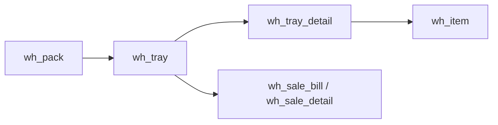

# 小包实体图

```mermaid
flowchart LR
    PACK["wh_pack"] --> TRAY["wh_tray"]
    TRAY --> TRAYDETAIL["wh_tray_detail"]
    TRAYDETAIL --> ITEM["wh_item"]
    TRAY --> SALE["wh_sale_bill / wh_sale_detail"]
```
