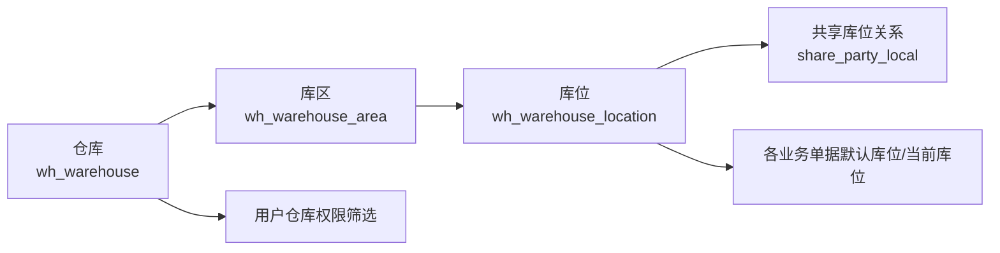

# 仓库结构实体链路图

```mermaid
flowchart LR
    A["仓库
    wh_warehouse"] --> B["库区
    wh_warehouse_area"]
    B --> C["库位
    wh_warehouse_location"]

    A --> D["用户仓库权限筛选"]
    C --> E["共享库位关系
    share_party_local"]
    C --> F["各业务单据默认库位/当前库位"]
```
