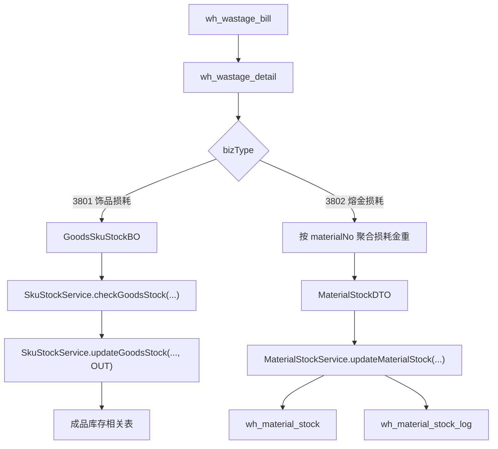

# 损耗单实体关系图
> 说明：损耗单按 `bizType` 分为“饰品损耗链”和“熔金损耗链”

```mermaid
flowchart TD
    A["wh_wastage_bill"] --> B["wh_wastage_detail"]

    B --> C{"bizType"}

    C -->|"3801 饰品损耗"| D["GoodsSkuStockBO"]
    D --> E["SkuStockService.checkGoodsStock(...)"]
    E --> F["SkuStockService.updateGoodsStock(..., OUT)"]
    F --> G["成品库存相关表"]

    C -->|"3802 熔金损耗"| H["按 materialNo 聚合损耗金重"]
    H --> I["MaterialStockDTO"]
    I --> J["MaterialStockService.updateMaterialStock(...)"]
    J --> K["wh_material_stock"]
    J --> L["wh_material_stock_log"]
```

## 说明
- 单头和明细是业务主链。
- 饰品损耗会先做库存充足检查，再扣减成品库存。
- 熔金损耗会按原料编码聚合，再统一落原料库存和库存日志。
- 损耗单不进入钱包链。
