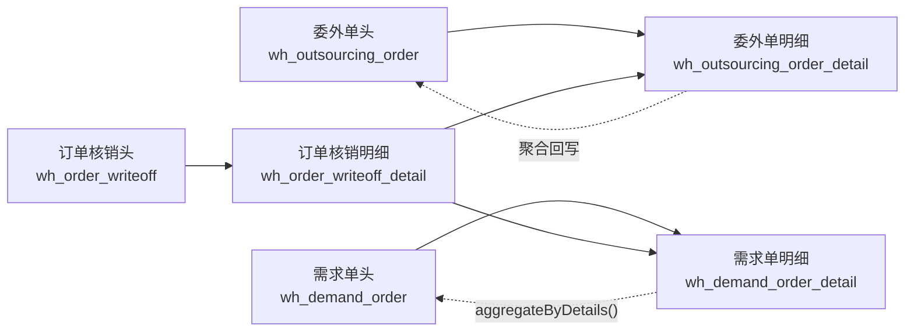

# 订单核销链实体图
> 基于 commit: `48af575a1314636c88e9f05ca3cb4443f88865bd`，日期：2026-03-31

## 适用范围
- 委外单进入待核销或部分核销后，订单核销模块如何选数、建单、审核、反审。
- 核销审核后如何回写委外单明细、委外单头、需求单明细、需求单头。
- 详情页如何计算“截止当前单据创建前”的累计核销汇总。

## Mermaid

## 关键关系
| 来源 | 目标 | 关系 |
|------|------|------|
| `wh_order_writeoff` | `wh_order_writeoff_detail` | 一对多，主单写入后回填 `orderId/orderNo` |
| `wh_order_writeoff_detail.outsourcingDetailId` | `wh_outsourcing_order_detail.id` | 核销行绑定委外单明细行 |
| `wh_order_writeoff_detail.outsourcingOrderId` | `wh_outsourcing_order.id` | 核销行归属委外单头 |
| `wh_order_writeoff_detail.demandDetailId` | `wh_demand_order_detail.id` | 核销行绑定需求单明细行 |
| `wh_order_writeoff_detail.demandOrderId` | `wh_demand_order.id` | 核销行归属需求单头 |

## 关键回写字段
| 目标表 | 字段 | 来源动作 |
|------|------|------|
| `wh_outsourcing_order_detail` | `totalPassNum/totalPassGramWeight` | `confirm/infirm` |
| `wh_outsourcing_order_detail` | `totalBadNum/totalBadGramWeight` | `confirm/infirm` |
| `wh_outsourcing_order_detail` | `totalReturnNum/totalReturnWeight` | `confirm/infirm` |
| `wh_outsourcing_order_detail` | `totalWriteoffNum/totalWriteoffGramWeight` | `confirm/infirm` |
| `wh_outsourcing_order` | `writeoffDate/totalDeliveryNum/totalDeliveryGramWeight/orderStatus` | `confirm/infirm` 后按全量委外明细聚合 |
| `wh_demand_order_detail` | `returnedNum/returnedWeight` | `confirm/infirm` |
| `wh_demand_order` | 聚合字段 + `writeoffDate` | `aggregateByDetails()` 后批量更新 |

## 关键说明
1. 核销单审核时，委外链记录“回货总量、合格量、不合格量、核销量”四套累计值。
2. 需求单链只吃“核销量”，而核销量又被代码定义为“合格量”，所以需求单侧的 `returned*` 实际更接近“累计合格核销量”。
3. `get(id)` 页面中的 `cutoff*` 字段不是实时总量，而是“当前单据创建前的历史累计”。
