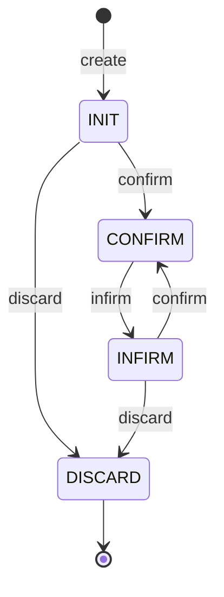

# 单件入库单状态机图

```mermaid
stateDiagram-v2
    [*] --> INIT : create
    INIT --> CONFIRM : confirm
    INIT --> DISCARD : discard
    CONFIRM --> INFIRM : infirm
    INFIRM --> CONFIRM : confirm
    INFIRM --> DISCARD : discard
    DISCARD --> [*]
```

## 说明
1. 更新只允许 `INIT/INFIRM`。
2. 反审除了状态检查，还会额外校验跨日权限 `ENTRY_BILL_CROSS_DAYS`。
3. 审核与反审都不是只改单头，而是会同时推进或回滚单件、库存、需求单、维修单四条子链。
