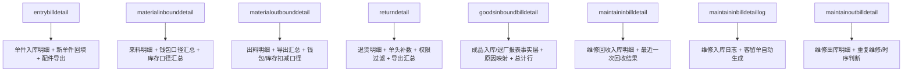

# 执行明细与日志卫星能力图

```mermaid
flowchart TD
    A["entrybilldetail"] --> B["单件入库明细 + 新单件回填 + 配件导出"]
    C["materialinbounddetail"] --> D["来料明细 + 钱包口径汇总 + 库存口径汇总"]
    E["materialoutbounddetail"] --> F["出料明细 + 导出汇总 + 钱包/库存扣减口径"]
    G["returndetail"] --> H["退货明细 + 单头补数 + 权限过滤 + 导出汇总"]
    I["goodsinboundbilldetail"] --> J["成品入库/退厂报表事实层 + 原因映射 + 总计行"]
    K["maintaininbilldetail"] --> L["维修回收入库明细 + 最近一次回收结果"]
    M["maintaininbilldetaillog"] --> N["维修入库日志 + 客留单自动生成"]
    O["maintainoutbilldetail"] --> P["维修出库明细 + 重复维修/时序判断"]
```
