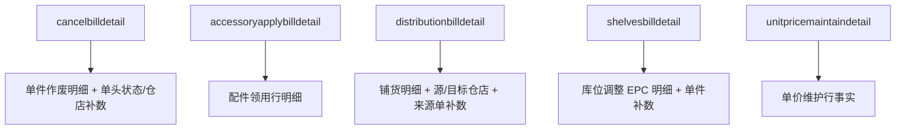

# 执行尾项明细能力图

```mermaid
flowchart TD
    A["cancelbilldetail"] --> B["单件作废明细 + 单头状态/仓店补数"]
    C["accessoryapplybilldetail"] --> D["配件领用行明细"]
    E["distributionbilldetail"] --> F["铺货明细 + 源/目标仓店 + 来源单补数"]
    G["shelvesbilldetail"] --> H["库位调整 EPC 明细 + 单件补数"]
    I["unitpricemaintaindetail"] --> J["单价维护行事实"]
```
