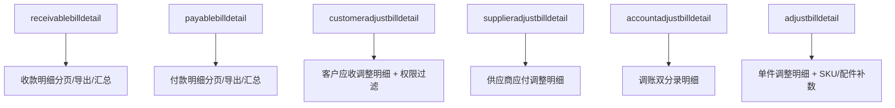

# 财务明细卫星能力图

```mermaid
flowchart TD
    A["receivablebilldetail"] --> B["收款明细分页/导出/汇总"]
    C["payablebilldetail"] --> D["付款明细分页/导出/汇总"]
    E["customeradjustbilldetail"] --> F["客户应收调整明细 + 权限过滤"]
    G["supplieradjustbilldetail"] --> H["供应商应付调整明细"]
    I["accountadjustbilldetail"] --> J["调账双分录明细"]
    K["adjustbilldetail"] --> L["单件调整明细 + SKU/配件补数"]
```

