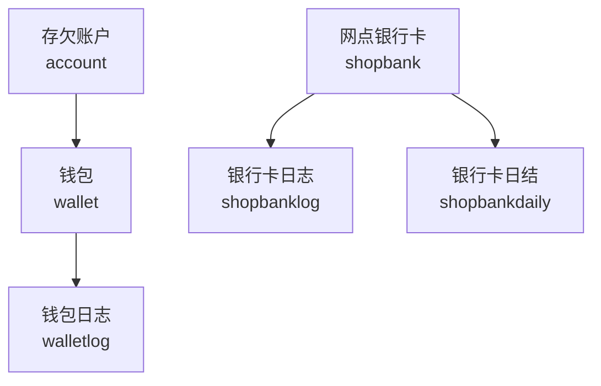

# 资金主数据状态图

```mermaid
flowchart TD
    A["存欠账户<br/>account"] --> B["钱包<br/>wallet"]
    B --> C["钱包日志<br/>walletlog"]
    D["网点银行卡<br/>shopbank"] --> E["银行卡日志<br/>shopbanklog"]
    D --> F["银行卡日结<br/>shopbankdaily"]
```
