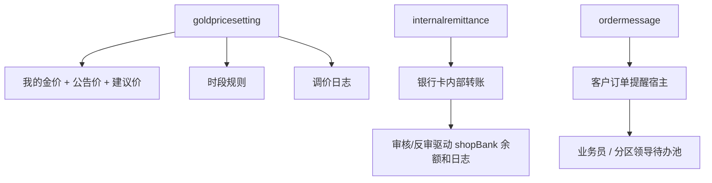

# 资金与消息尾项能力图

```mermaid
flowchart TD
    A["goldpricesetting"] --> A1["我的金价 + 公告价 + 建议价"]
    A --> A2["时段规则"]
    A --> A3["调价日志"]
    B["internalremittance"] --> B1["银行卡内部转账"]
    B1 --> B2["审核/反审驱动 shopBank 余额和日志"]
    C["ordermessage"] --> C1["客户订单提醒宿主"]
    C1 --> C2["业务员 / 分区领导待办池"]
```
