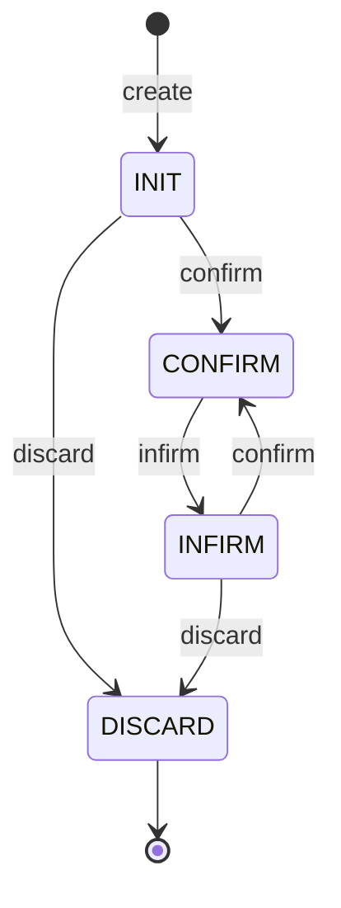

# 成品入库单状态机图

```mermaid
stateDiagram-v2
    [*] --> INIT : create
    INIT --> CONFIRM : confirm
    INIT --> DISCARD : discard
    CONFIRM --> INFIRM : infirm
    INFIRM --> CONFIRM : confirm
    INFIRM --> DISCARD : discard
    DISCARD --> [*]
```

## 说明
1. 更新只允许 `INIT/INFIRM`
2. 作废也只允许 `INIT/INFIRM`
3. 反审前除状态外，还会检查跨日权限和“是否已被半成品调拨引用”
