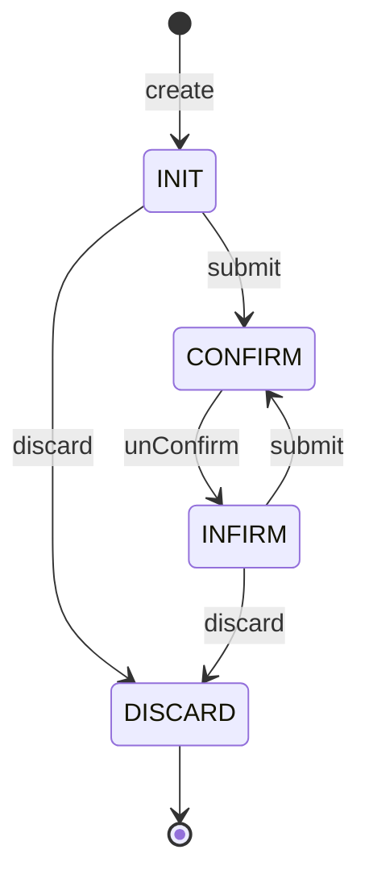

# 成品转料单状态机图

```mermaid
stateDiagram-v2
    [*] --> INIT : create
    INIT --> CONFIRM : submit
    INIT --> DISCARD : discard
    CONFIRM --> INFIRM : unConfirm
    INFIRM --> CONFIRM : submit
    INFIRM --> DISCARD : discard
    DISCARD --> [*]
```

## 说明
1. 更新只允许 `INIT/INFIRM`。
2. 反审除状态外，还会校验跨日权限 `GOODS_RECYCLE_BILL_CROSS_DAYS`。
3. 带 `itemNo` 的明细还会同步驱动单件转料子状态流。
