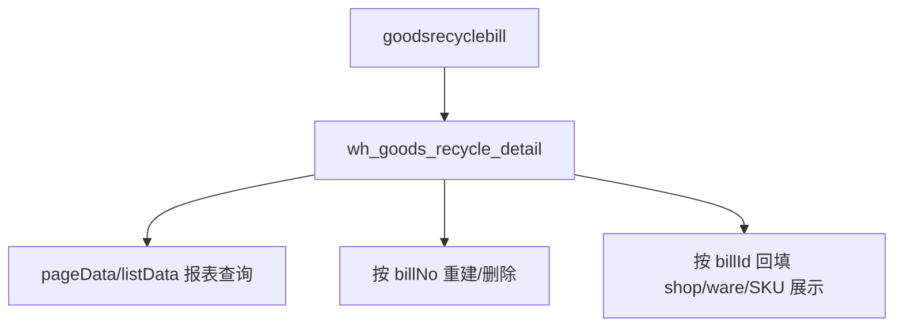

# 成品转料明细能力图

```mermaid
flowchart TD
    A["goodsrecyclebill"] --> B["wh_goods_recycle_detail"]
    B --> C["pageData/listData 报表查询"]
    B --> D["按 billNo 重建/删除"]
    B --> E["按 billId 回填 shop/ware/SKU 展示"]
```
