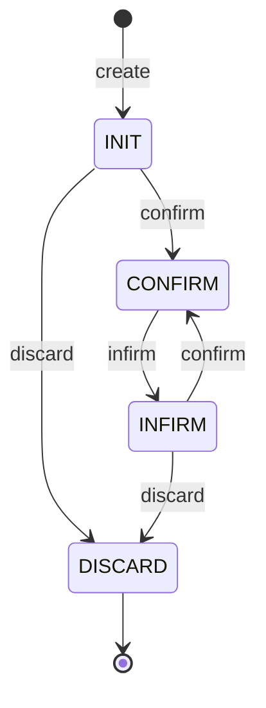

# 成品退厂单状态机图

```mermaid
stateDiagram-v2
    [*] --> INIT : create
    INIT --> CONFIRM : confirm
    INIT --> DISCARD : discard
    CONFIRM --> INFIRM : infirm
    INFIRM --> CONFIRM : confirm
    INFIRM --> DISCARD : discard
    DISCARD --> [*]
```

## 说明
1. 更新只允许 `INIT/INFIRM`。
2. 作废只允许 `INIT/INFIRM`，并会解除登记单或半成品调拨来源挂接。
3. 反审除状态外，还会校验跨日权限 `GOODS_REJECT_BILL_CROSS_DAYS`。
