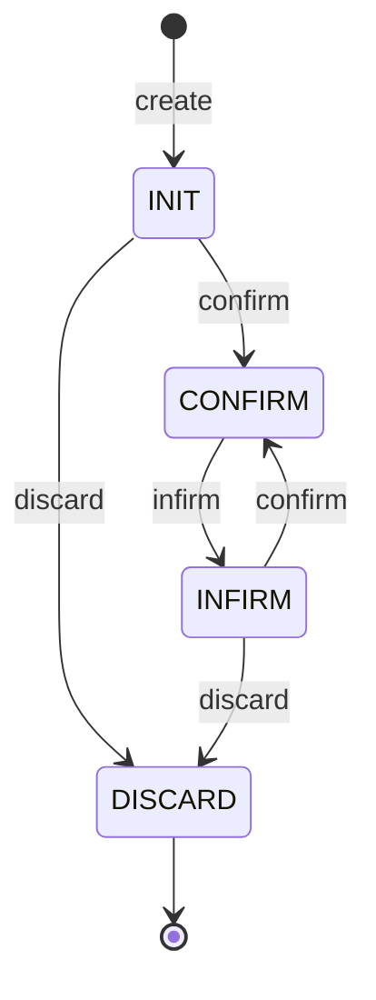
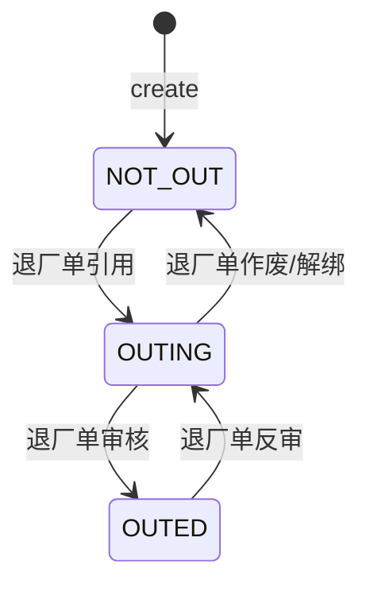

# 成品退厂登记单状态机图

```mermaid
stateDiagram-v2
    [*] --> INIT : create
    INIT --> CONFIRM : confirm
    INIT --> DISCARD : discard
    CONFIRM --> INFIRM : infirm
    INFIRM --> CONFIRM : confirm
    INFIRM --> DISCARD : discard
    DISCARD --> [*]
```

## 补充字段状态

```mermaid
stateDiagram-v2
    [*] --> NOT_OUT : create
    NOT_OUT --> OUTING : 退厂单引用
    OUTING --> OUTED : 退厂单审核
    OUTED --> OUTING : 退厂单反审
    OUTING --> NOT_OUT : 退厂单作废/解绑
```

## 说明
1. `billStatus` 表示登记单自身是否审核。
2. `outOfWare` 表示它是否已经被退厂执行链占用并实际出库。
3. 两套状态必须分开看。
