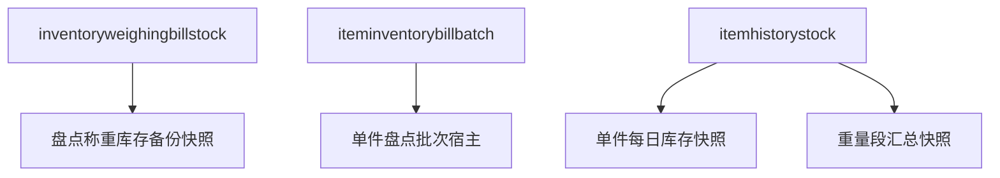

# 盘点批次与历史库存能力图

```mermaid
flowchart TD
    A["inventoryweighingbillstock"] --> A1["盘点称重库存备份快照"]
    B["iteminventorybillbatch"] --> B1["单件盘点批次宿主"]
    C["itemhistorystock"] --> C1["单件每日库存快照"]
    C --> C2["重量段汇总快照"]
```
