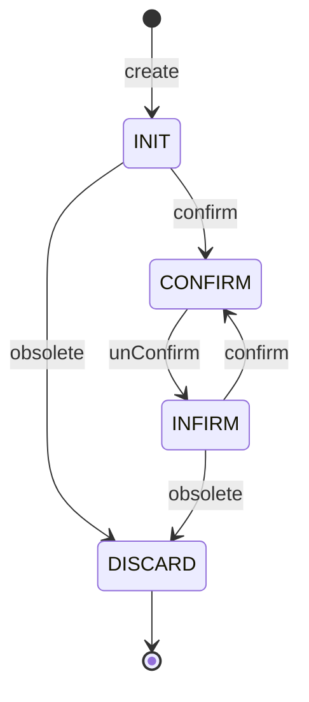

# 盘点称重单状态机图

```mermaid
stateDiagram-v2
    [*] --> INIT : create
    INIT --> CONFIRM : confirm
    INIT --> DISCARD : obsolete
    CONFIRM --> INFIRM : unConfirm
    INFIRM --> CONFIRM : confirm
    INFIRM --> DISCARD : obsolete
    DISCARD --> [*]
```

## 说明
1. 这个模块没有 BPM，审核/反审都是本地状态切换。
2. 审核时主要动作是计算并回写盈亏差值，不是直接改库存。
3. 反审时只清空差值结果，不回写库存。

