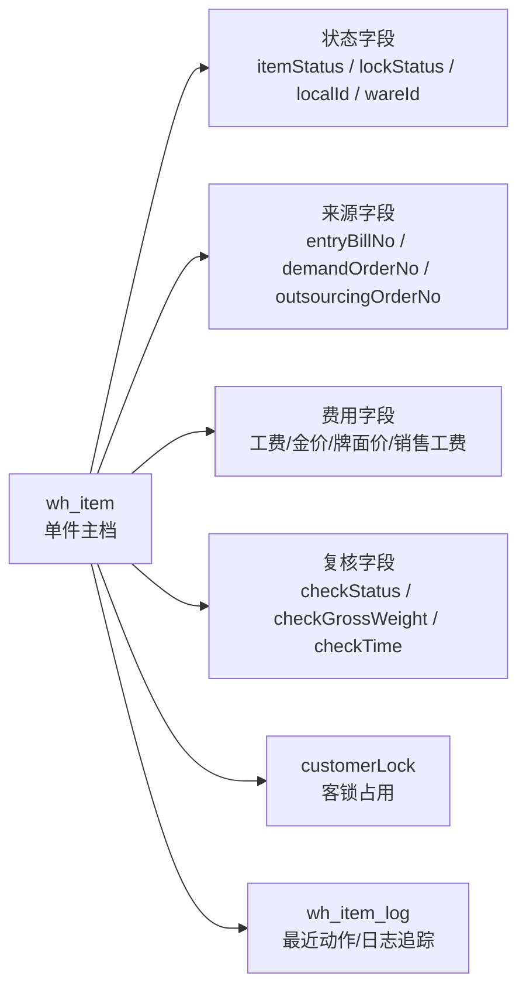

# 单件明细状态/能力图

```mermaid
flowchart LR
    A["wh_item\n单件主档"] --> B["状态字段\nitemStatus / lockStatus / localId / wareId"]
    A --> C["来源字段\nentryBillNo / demandOrderNo / outsourcingOrderNo"]
    A --> D["费用字段\n工费/金价/牌面价/销售工费"]
    A --> E["复核字段\ncheckStatus / checkGrossWeight / checkTime"]
    A --> F["customerLock\n客锁占用"]
    A --> G["wh_item_log\n最近动作/日志追踪"]
```

## 说明
1. 单件明细没有单独状态机，而是以 `wh_item` 上的多组状态字段组合表达当前位置和可操作性。
2. `itemStatus + lockStatus + wareId + localId` 是绝大多数执行链判断单件是否可用的基础前置条件。
3. `wh_item_log` 决定了“最近动作”“最后单号”等查询展示口径。

