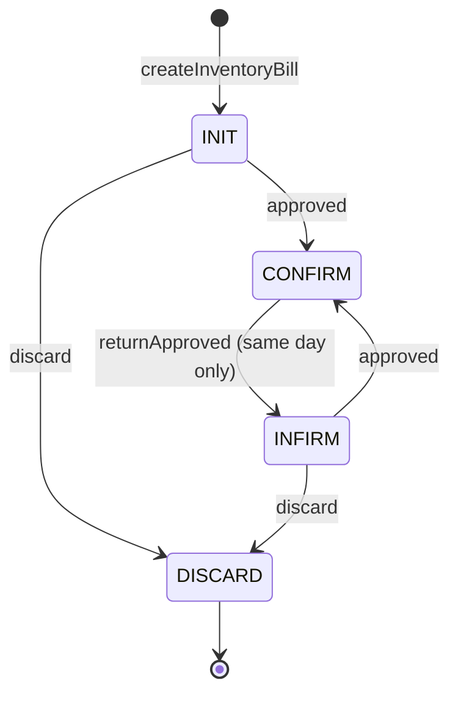

# 单件盘点单状态机图

```mermaid
stateDiagram-v2
    [*] --> INIT : createInventoryBill
    INIT --> CONFIRM : approved
    INIT --> DISCARD : discard
    INFIRM --> CONFIRM : approved
    INFIRM --> DISCARD : discard
    CONFIRM --> INFIRM : returnApproved (same day only)
    DISCARD --> [*]
```

## 说明
1. 这个模块没有 BPM，审核和反审都是本地状态切换。
2. 审核/反审当前只改单头状态，没有看到库存或单件主数据的正式过账。
3. 批次作废是独立于单头状态流的侧链，撤销的是批次采集结果，不是整张盘点单。
