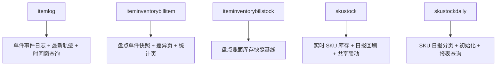

# 单件盘点与款式库存卫星能力图

```mermaid
flowchart TD
    A["itemlog"] --> B["单件事件日志 + 最新轨迹 + 时间窗查询"]
    C["iteminventorybillitem"] --> D["盘点单件快照 + 差异页 + 统计页"]
    E["iteminventorybillstock"] --> F["盘点账面库存快照基线"]
    G["skustock"] --> H["实时 SKU 库存 + 日报回刷 + 共享联动"]
    I["skustockdaily"] --> J["SKU 日报分页 + 初始化 + 报表查询"]
```
