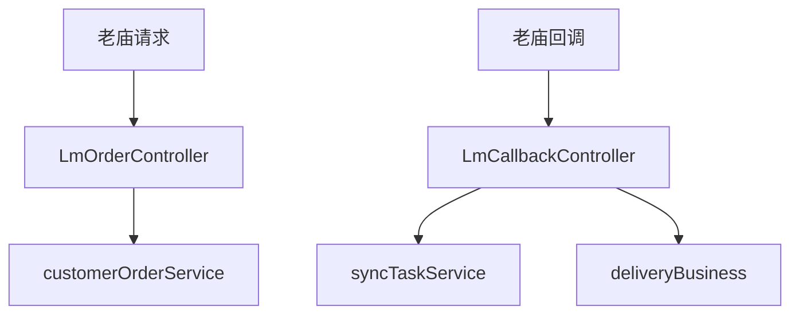

# 老庙订单与回调接口状态图

```mermaid
flowchart TD
    A["老庙请求"] --> B["LmOrderController"]
    B --> C["customerOrderService"]

    D["老庙回调"] --> E["LmCallbackController"]
    E --> F["syncTaskService"]
    E --> G["deliveryBusiness"]
```
