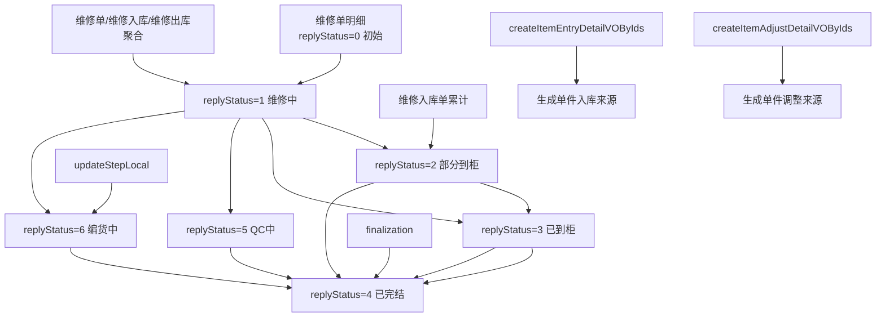

# 维修单详情状态/能力图

## 说明
1. 维修单详情没有自己的 `billStatus` 审核流，核心状态是明细级 `replyStatus`。
2. `finalization(...)` 是终态入口，会把明细直接推进到 `COMPLETED`。
3. “编货中”不是通用流转节点，而是 `updateStepLocal(...)` 在仓库名称命中 `"编货仓"` 时硬编码写入的状态。
