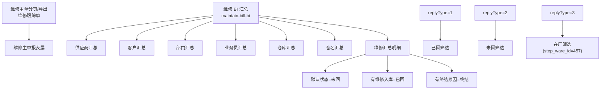

# 维修单报表能力图

```mermaid
flowchart TD
    A["维修主单分页/导出\n维修跟踪单"] --> B["维修主单报表层"]
    C["维修 BI 汇总\nmaintain-bill-bi"] --> D["供应商汇总"]
    C --> E["客户汇总"]
    C --> F["部门汇总"]
    C --> G["业务员汇总"]
    C --> H["仓库汇总"]
    C --> I["仓名汇总"]
    C --> J["维修汇总明细"]

    J --> K["默认状态=未回"]
    J --> L["有维修入库=已回"]
    J --> M["有终结原因=终结"]

    N["replyType=1"] --> O["已回筛选"]
    P["replyType=2"] --> Q["未回筛选"]
    R["replyType=3"] --> S["在厂筛选(step_ware_id=457)"]
```

## 说明
1. 维修单报表不是审批流，而是查询/导出能力集合。
2. 报表层会重算“未回/已回/终结”等展示状态，不完全等于明细表原始 `replyStatus`。
3. “在厂”目前依赖 `step_ware_id = 457` 的硬编码筛选。
