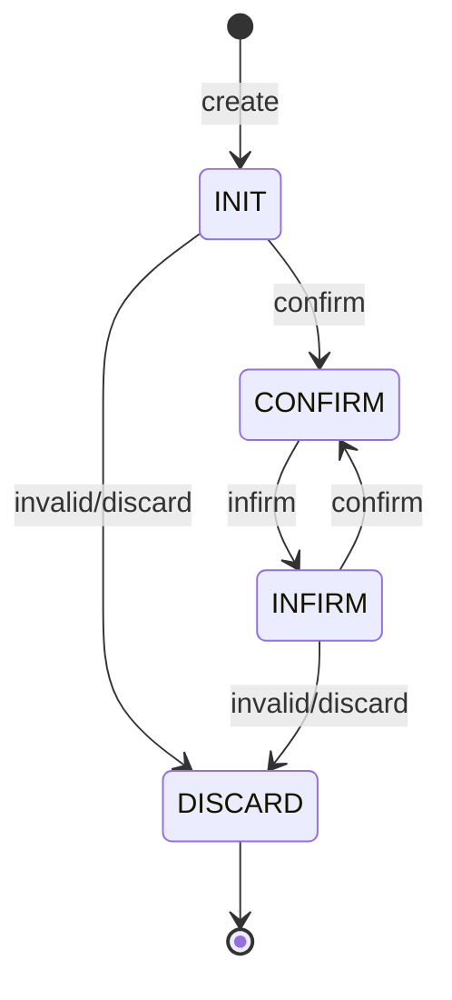

# 维修单状态机图

## 说明
1. `billStatus` 只描述单头审核态，不能代表维修业务全流程。
2. 维修单还有独立的 `replyStatus` 进度态：从“初始/维修中”逐步推进到“部分到柜/已到柜/已完结”。
3. `transferStatus` 还是第三条辅助状态线，用来标记是否已执行一键调拨。
4. 所以维修单真实上是“三状态并存”：审核态、维修进度态、调拨执行态。
