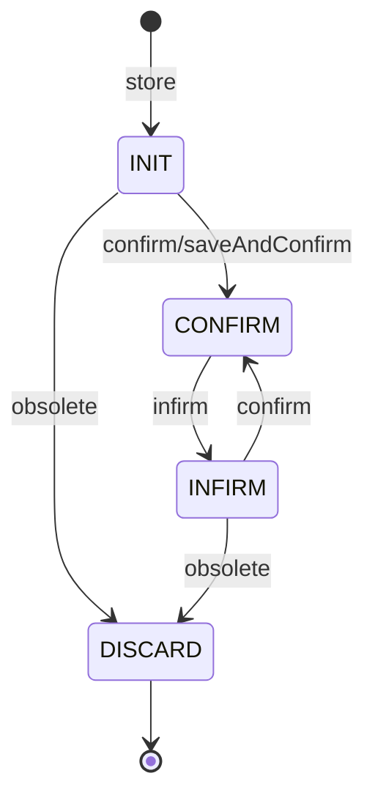

# 维修入库单状态机图

```mermaid
stateDiagram-v2
    [*] --> INIT : store
    INIT --> CONFIRM : confirm/saveAndConfirm
    INIT --> DISCARD : obsolete
    CONFIRM --> INFIRM : infirm
    INFIRM --> CONFIRM : confirm
    INFIRM --> DISCARD : obsolete
    DISCARD --> [*]
```

## 说明
1. 这是标准审核态：`0/1/2/3 = INIT/CONFIRM/INFIRM/DISCARD`。
2. 真正重动作发生在审核/反审业务层，不在单头状态值本身。
3. 作废只允许未审/反审态，并会解除维修出库侧的草稿下推挂接。
