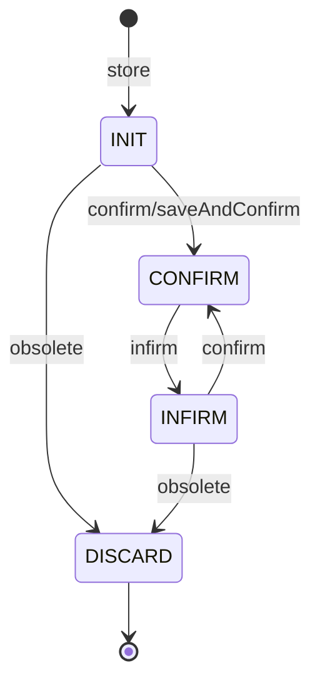

# 维修出库单状态机图

```mermaid
stateDiagram-v2
    [*] --> INIT : store
    INIT --> CONFIRM : confirm/saveAndConfirm
    INIT --> DISCARD : obsolete
    CONFIRM --> INFIRM : infirm
    INFIRM --> CONFIRM : confirm
    INFIRM --> DISCARD : obsolete
    DISCARD --> [*]
```

## 说明
1. 审核态仍是标准 `0/1/2/3 = INIT/CONFIRM/INFIRM/DISCARD`。
2. 真正复杂度不在状态机，而在审核/反审时对维修单明细、退厂登记池和供应商钱包的联动回写。
3. 反审比普通单据更严格，因为一旦已有维修入库或下推链承接，就会被锁死。
