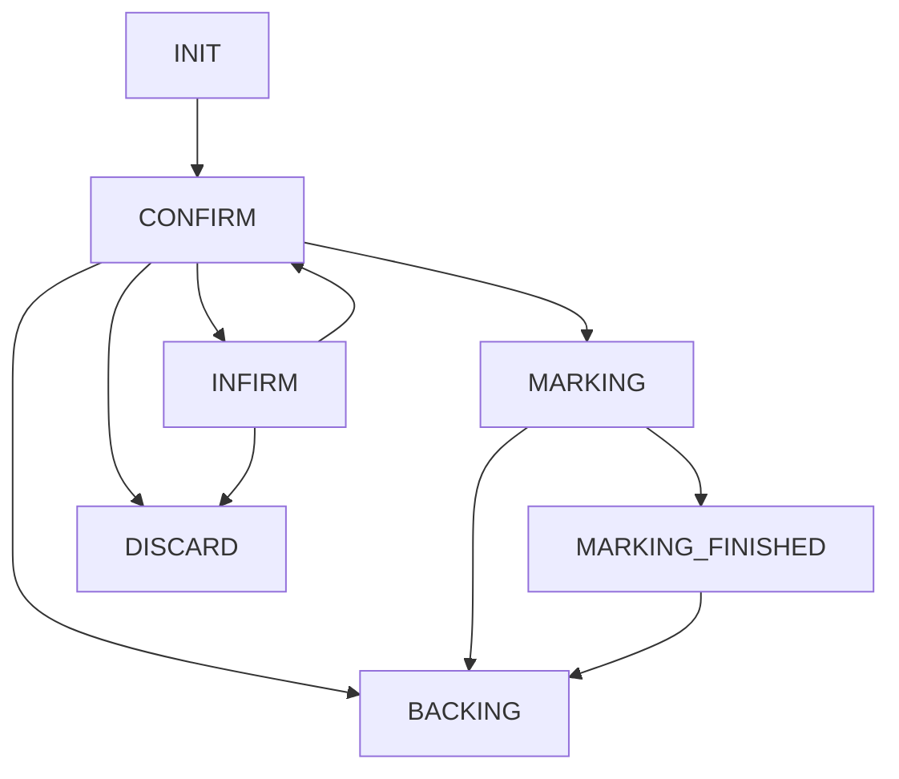

# 字印单状态机图

```mermaid
flowchart TD
    A["INIT"] --> B["CONFIRM"]
    C["INFIRM"] --> B
    B --> C
    B --> D["MARKING"]
    D --> E["MARKING_FINISHED"]
    B --> F["DISCARD"]
    C --> F
    B --> G["BACKING"]
    D --> G
    E --> G
```
