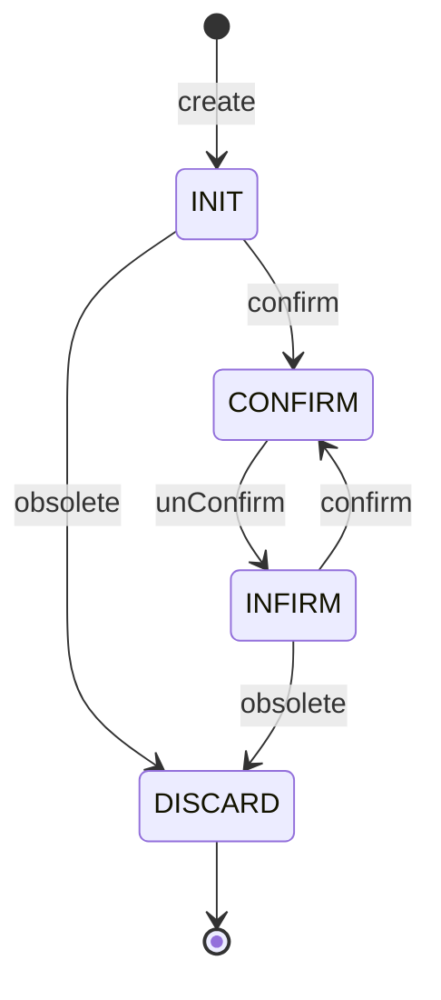

# 客户来料单状态机图

```mermaid
stateDiagram-v2
    [*] --> INIT : create
    INIT --> CONFIRM : confirm
    INIT --> DISCARD : obsolete
    CONFIRM --> INFIRM : unConfirm
    INFIRM --> CONFIRM : confirm
    INFIRM --> DISCARD : obsolete
    DISCARD --> [*]
```

## 说明
1. 创建后默认进入 `INIT`
2. 审核把状态推进到 `CONFIRM`
3. 反审把状态回退到 `INFIRM`
4. 作废走 `obsolete()`，依赖 `BillStatusEnum.obsoleteCheck(...)`
5. 更新只允许 `INIT/INFIRM`
