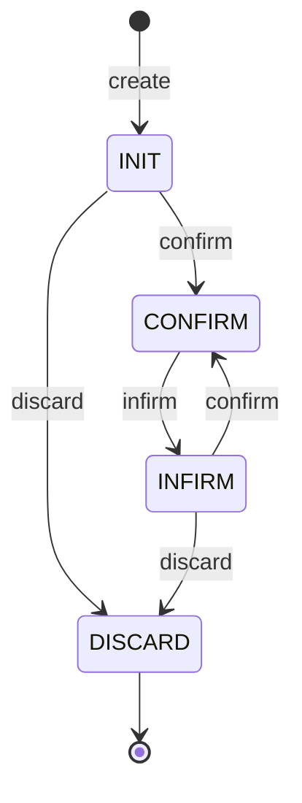

# 客户出料单状态机图

```mermaid
stateDiagram-v2
    [*] --> INIT : create
    INIT --> CONFIRM : confirm
    INIT --> DISCARD : discard
    CONFIRM --> INFIRM : infirm
    INFIRM --> CONFIRM : confirm
    INFIRM --> DISCARD : discard
    DISCARD --> [*]
```

## 说明
1. 更新只允许 `INIT/INFIRM`
2. 审核扣库存、扣钱包
3. 反审回补库存、回补钱包
