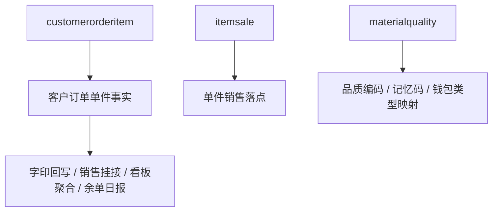

# 客户订单单件与原料品质尾项能力图

```mermaid
flowchart TD
    A["customerorderitem"] --> A1["客户订单单件事实"]
    A1 --> A2["字印回写 / 销售挂接 / 看板聚合 / 余单日报"]
    B["itemsale"] --> B1["单件销售落点"]
    C["materialquality"] --> C1["品质编码 / 记忆码 / 钱包类型映射"]
```
