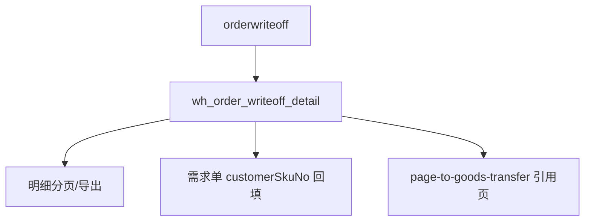

# 订单核销明细能力图

```mermaid
flowchart TD
    A["orderwriteoff"] --> B["wh_order_writeoff_detail"]
    B --> C["明细分页/导出"]
    B --> D["需求单 customerSkuNo 回填"]
    B --> E["page-to-goods-transfer 引用页"]
```
