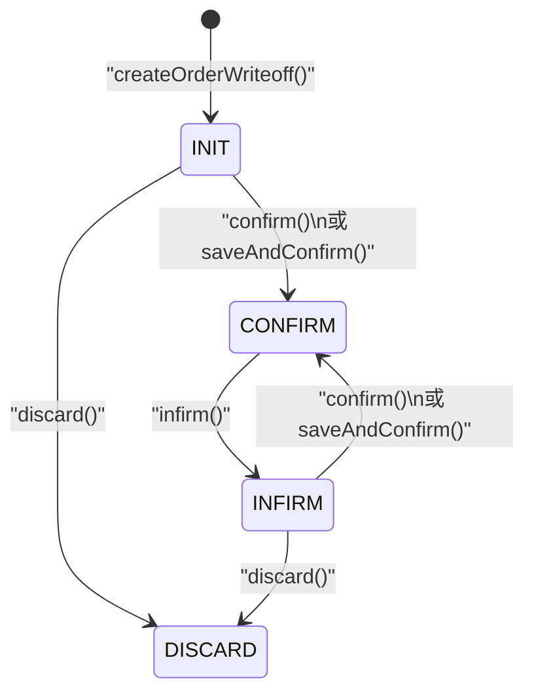
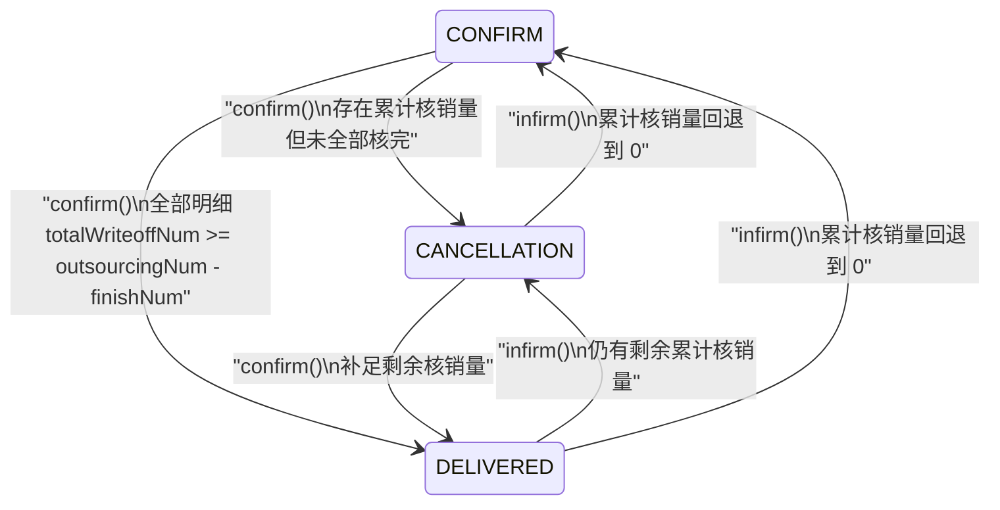

# 订单核销状态机图
> 基于 commit: `48af575a1314636c88e9f05ca3cb4443f88865bd`，日期：2026-03-31

## 说明
- `wh_order_writeoff.order_status` 是核销单头状态，只覆盖建单、审核、反审、作废四个阶段。
- 业务上的“部分核销/核销完毕”并不写在核销单头，而是写在委外单头 `wh_outsourcing_order.order_status`。
- 因此分析订单核销时，必须同时看核销单头状态和委外单头状态，不能只看 `wh_order_writeoff.order_status`。

## 核销单头状态机

## 委外单头联动状态机

## 关键迁移说明

### 核销单头
1. `createOrderWriteoff()` 新建后进入 `INIT`。
2. `confirm()` 和 `saveAndConfirm()` 可把 `INIT/INFIRM -> CONFIRM`。
3. `infirm()` 可把 `CONFIRM -> INFIRM`，同时清空审核人和审核时间。
4. `discard()` 只允许在未审核链路作废，即 `INIT/INFIRM -> DISCARD`。

### 委外单头
1. 审核时，先更新每条委外明细累计值，再按全量明细聚合委外单头。
2. 只要出现累计核销量但尚未全部核完，委外单头进入 `CANCELLATION(已部分核销)`。
3. 所有明细都达到 `totalWriteoffNum >= outsourcingNum - finishNum` 后，委外单头进入 `DELIVERED(核销完毕)`。
4. 反审时，如果累计核销量全部扣回 0，委外单头退回 `CONFIRM(待核销)`。

## 关键前置条件
| 动作 | 关键前置条件 |
|------|-------------|
| `confirm` | 核销单头状态必须是 `INIT/INFIRM`，且每行回货/不合格相关字段不能同时全为 0 |
| `infirm` | 核销单头状态必须是 `CONFIRM` |
| `discard` | 当前状态不能是 `CONFIRM` |

## 关联说明
- 核销单头状态不承载“部分核销/核销完毕”，这些状态只存在于委外单头。
- 需求单没有单独的“核销状态字段”在本模块中直接维护，需求单侧由明细累计回货量和 `aggregateByDetails()` 聚合结果体现业务推进。
