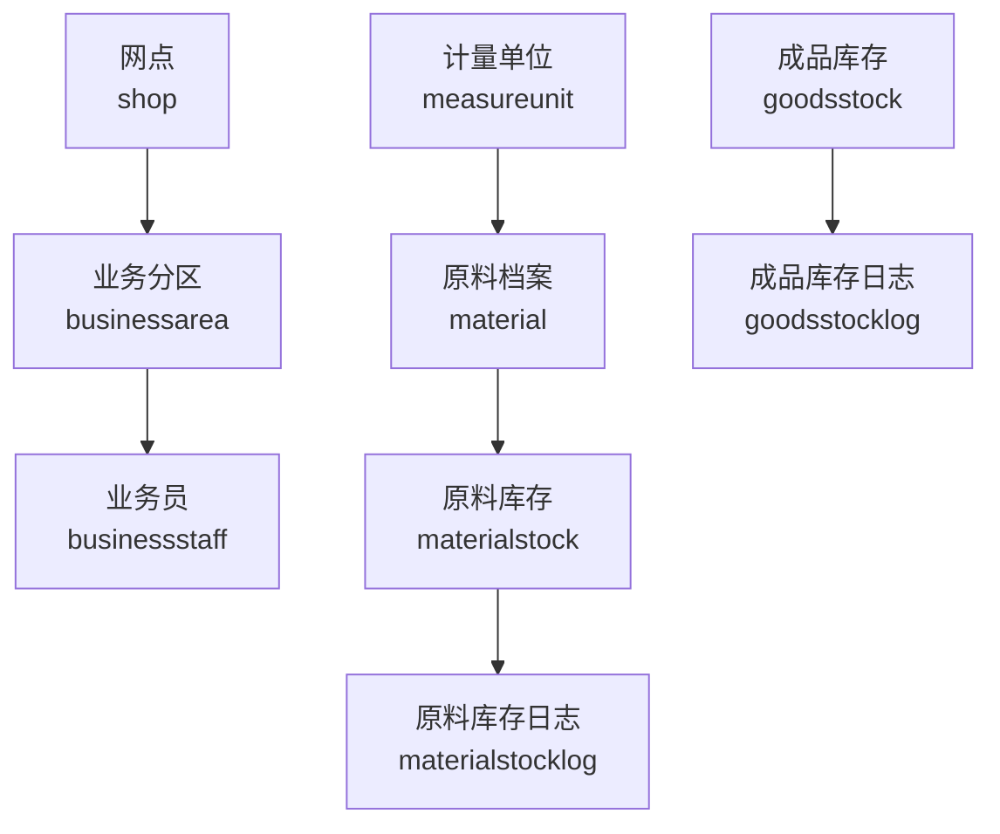

# 组织与库存主数据状态图

```mermaid
flowchart TD
    A["网点<br/>shop"] --> B["业务分区<br/>businessarea"]
    B --> C["业务员<br/>businessstaff"]
    D["计量单位<br/>measureunit"] --> E["原料档案<br/>material"]
    E --> F["原料库存<br/>materialstock"]
    F --> G["原料库存日志<br/>materialstocklog"]
    H["成品库存<br/>goodsstock"] --> I["成品库存日志<br/>goodsstocklog"]
```
