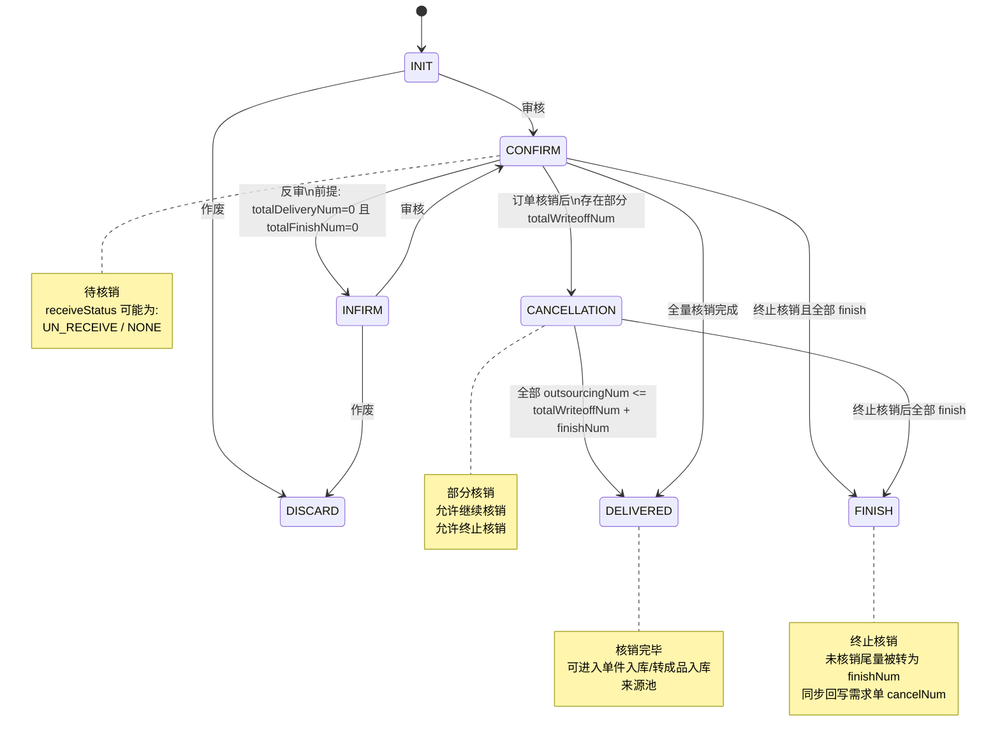

# 委外加工订单状态机图

```mermaid
stateDiagram-v2
    [*] --> INIT

    INIT --> CONFIRM: 审核
    INFIRM --> CONFIRM: 审核

    CONFIRM --> INFIRM: 反审\n前提: totalDeliveryNum=0 且 totalFinishNum=0
    INIT --> DISCARD: 作废
    INFIRM --> DISCARD: 作废

    CONFIRM --> CANCELLATION: 订单核销后\n存在部分 totalWriteoffNum
    CANCELLATION --> DELIVERED: 全部 outsourcingNum <= totalWriteoffNum + finishNum
    CONFIRM --> FINISH: 终止核销且全部 finish
    CANCELLATION --> FINISH: 终止核销后全部 finish
    CONFIRM --> DELIVERED: 全量核销完成

    note right of CONFIRM
      待核销
      receiveStatus 可能为:
      UN_RECEIVE / NONE
    end note

    note right of CANCELLATION
      部分核销
      允许继续核销
      允许终止核销
    end note

    note right of DELIVERED
      核销完毕
      可进入单件入库/转成品入库来源池
    end note

    note right of FINISH
      终止核销
      未核销尾量被转为 finishNum
      同步回写需求单 cancelNum
    end note
```
