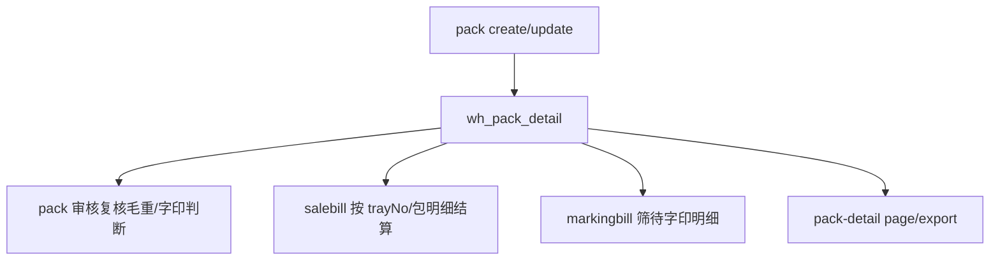

# 产品包明细能力图

```mermaid
flowchart TD
    A["pack create/update"] --> B["wh_pack_detail"]
    B --> C["pack 审核复核毛重/字印判断"]
    B --> D["salebill 按 trayNo/包明细结算"]
    B --> E["markingbill 筛待字印明细"]
    B --> F["pack-detail page/export"]
```
